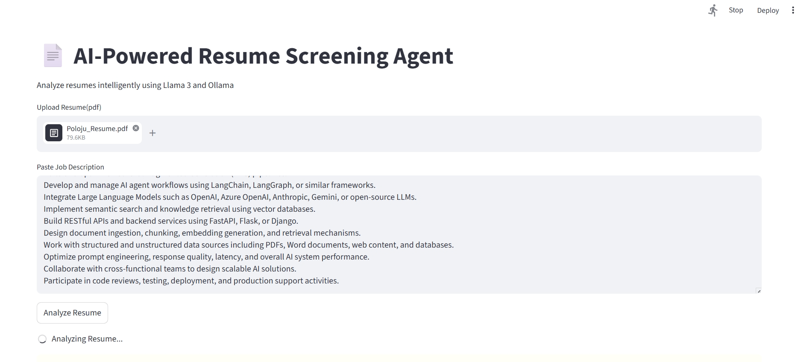

# AI-Powered Resume Screening Agent

An AI-powered Resume Screening application using Streamlit, Ollama, and Llama 3.

## Features

- Resume PDF Upload
- ATS Score Analysis
- Skill Matching
- Missing Skill Detection
- Hiring Recommendation
- Local LLM Processing

## Tech Stack

- Python
- Streamlit
- Ollama
- Llama 3
- PyMuPDF

## Installation

### Clone Repository

```bash
git clone https://github.com/PolojuSathish/AI-Resume-Screening-Agent.git
cd AI-Resume-Screener

## Application Preview

